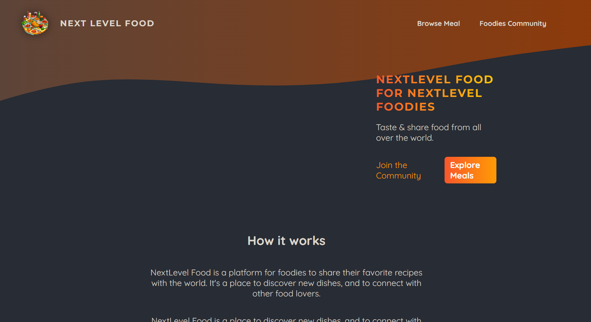
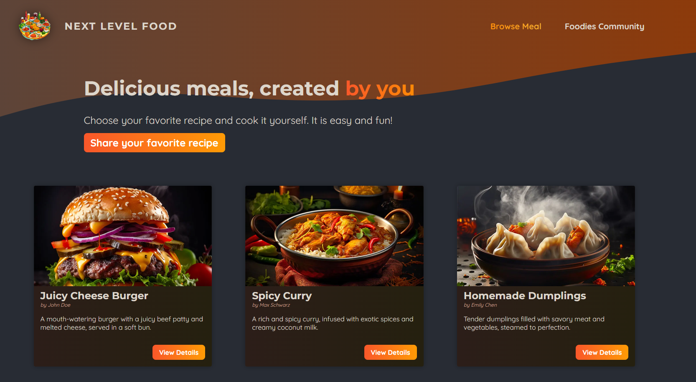
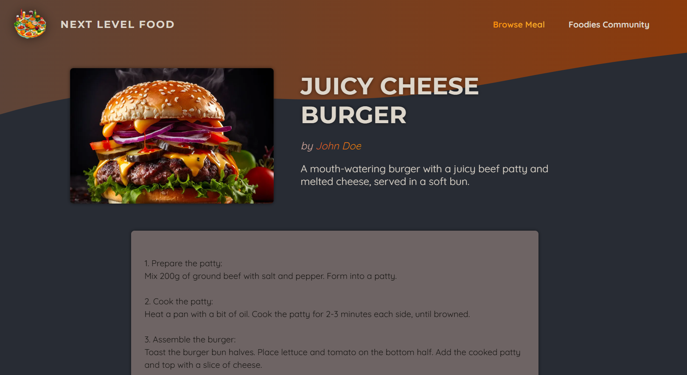
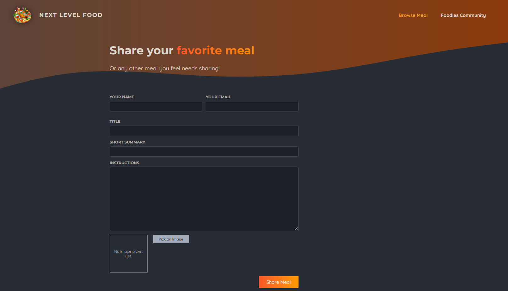
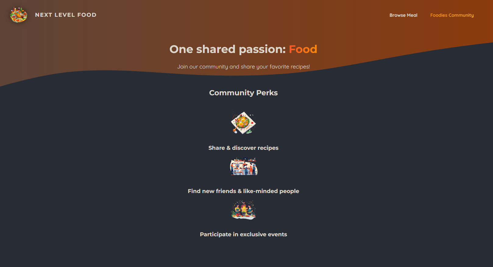

# Foodies App
- Next.js based full application.
This is the First application created using Next.js while exploration.
## Below are the functionlity of the application.
- Visit the Homepage
- Browse meals
    - Different card for different meals and button on top to view more details for the meal.
    - A dynamic page generated for that meal.
- You can share your favourite recipes.

## Pages
### Home page ['/']

### Browse Meals ['/meals']

### Dynamically generated detailed page for the meal ['/meals/<dynamic-meal-name>']

### Favourite recipes form page ['/meals/share']

### Foodies community page ['/community']
